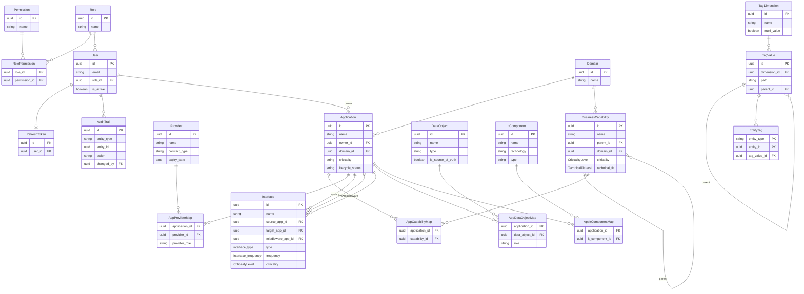

# docs/04-Tech — Référence technique ARK-EPM

Ce dossier contient les documents de référence technique du projet ARK-EPM.

| Fichier | Contenu |
|---|---|
| `ARK-Architecture-Setup.md` | Stack, structure du projet, Docker Compose, points de modélisation critiques |
| `ARK-NFR.md` | Exigences non-fonctionnelles (performance, sécurité, disponibilité…) |
| `openapi.yaml` | Contrat API REST complet (OpenAPI 3.0) — source de vérité des endpoints |
| `schema.sql` | Schéma PostgreSQL complet (DDL) — à jour avec `backend/prisma/schema.prisma` |

---

## Modèle de données

Le modèle de données est organisé en cinq domaines fonctionnels :

- **RBAC** — Gestion des utilisateurs, rôles et permissions (`users`, `roles`, `permissions`, `refresh_tokens`)
- **Gouvernance** — Domaines métier (`domains`)
- **Méta-modèle applicatif** — Entités principales : applications, fournisseurs, capacités métier, interfaces, objets de données, composants IT
- **Système de tags** — Tags hiérarchiques multi-valeurs attachables à n'importe quelle entité (`tag_dimensions`, `tag_values`, `entity_tags`)
- **Audit** — Journal de toutes les modifications via trigger PostgreSQL (`audit_trail`)

La source de vérité du modèle est `backend/prisma/schema.prisma`. Le fichier `schema.sql` en est la traduction PostgreSQL documentaire.

### Enums

| Type PostgreSQL | Valeurs | Utilisé par |
|---|---|---|
| `"CriticalityLevel"` | `LOW` `MEDIUM` `HIGH` `CRITICAL` | `business_capabilities.criticality`, `interfaces.criticality` |
| `"TechnicalFitLevel"` | `ADEQUATE` `PARTIAL` `INADEQUATE` `LEGACY` | `business_capabilities.technical_fit` |
| `interface_type` | `REST` `SOAP` `FTP` `SFTP` `DATABASE` `MESSAGE_QUEUE` `BATCH_FILE` `EVENT_STREAM` `GRAPHQL` `GRPC` `OTHER` | `interfaces.type` |
| `interface_frequency` | `REALTIME` `NEAR_REALTIME` `HOURLY` `DAILY` `WEEKLY` `MONTHLY` `ON_DEMAND` | `interfaces.frequency` |

> Les enums `"CriticalityLevel"` et `"TechnicalFitLevel"` sont en PascalCase (pas de `@@map` dans schema.prisma — Prisma conserve le nom exact de l'enum).

### Diagramme

